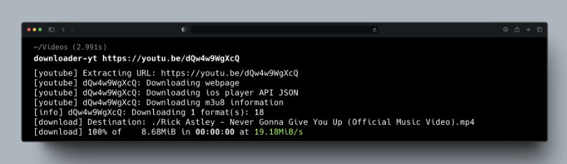

# DOWNLOADER-YT

<div align="center">

</br>
Download videos from YouTube
</div>




## Usage
To download a video from YouTube, you need to run the following command in the terminal:
```bash
-----
```bash
downloader-yt https://youtu.be/dQw4w9WgXcQ
```
